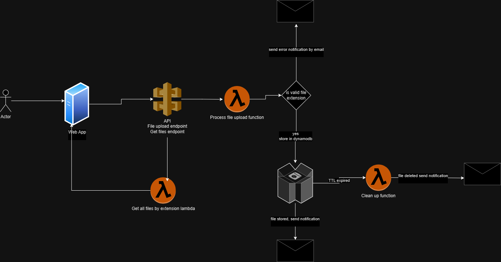

# Welcome to SoftUni AWS REgular Exam

This is a project fulfilling the regular exam assigment for the [AWS Essentials - October 2024 course](https://softuni.bg/trainings/4776/aws-essentials-october-2024#lesson-79843)

## Useful commands

- `npm ci` install necessary dependencies
- `npm run build` compile typescript to js
- `npm run watch` watch for changes and compile
- `npm run test` perform the jest unit tests
- `npx cdk deploy` deploy this stack to your default AWS account/region
- `npx cdk diff` compare deployed stack with current state
- `npx cdk synth` emits the synthesized CloudFormation template
- `npm run format` - run linting and formatting

## EC2 information

- Public IPv4 address - [18.184.28.246](http://18.184.28.246/)
- Public IPv4 DNS - https://ec2-18-184-28-246.eu-central-1.compute.amazonaws.com/
- [How to disable cors in chrome](https://medium.com/@beligh.hamdi/run-chrome-browser-without-cors-872747142c61) - you will have to disable cors to for the API to work

## API Gateway Endpoints

### 1. **GET /files**

- **URL:**  
  `https://enilzoplee.execute-api.eu-central-1.amazonaws.com/prod/processFile?extension={extension}`  
  _Retrieve all files with the specified file extension._

- **Method:**  
  `GET`

- **Query Parameters:**
  - `extension` (required): The file extension to filter the files by (e.g., `.pdf`, `.jpg`, `.png`).

---

### 2. **POST /files**

- **URL:**  
  `https://enilzoplee.execute-api.eu-central-1.amazonaws.com/prod/processFile/files`  
  _Upload a file and store its metadata in the database._

- **Method:**  
  `POST`

- **Body:**
  - The file and its metadata (e.g., file extension, file size, and upload date).

## Architecture overview

The architecture for this assignment is designed to process incoming JSON objects, validate them, and handle error scenarios by storing information in DynamoDB, sending emails via Amazon SNS, and automatically deleting records after 30 minutes. The solution utilizes the following AWS services:

1. AWS Lambda: Used as the core compute service to process incoming JSON requests, validate them, and interact with DynamoDB and SNS. Lambda functions are serverless, making them scalable and cost-efficient for handling variable loads.

2. API Gateway: Provides a secure, public HTTP endpoint for receiving requests from external clients like curl or Postman. It acts as the entry point to trigger the Lambda function when a valid HTTP request is made.

3. DynamoDB: This NoSQL database stores the error records when an invalid JSON is received. The TTL (Time To Live) feature in DynamoDB ensures that records are automatically deleted after 30 minutes, reducing manual cleanup efforts.

4. Amazon SNS: Simple Notification Service (SNS) is used to send emails when a valid JSON is processed or when an item in DynamoDB is deleted. SNS is highly reliable and scalable for email notifications and decouples the processing logic from the communication aspect.

5. Amazon CloudWatch: CloudWatch monitors the Lambda functions and logs. It ensures the smooth running of the entire pipeline, providing detailed logs for troubleshooting.

6. Amazon EC2 is a web service that provides scalable compute capacity in the cloud. It allows users to launch and manage virtual machines (instances) on-demand, providing a flexible and cost-effective way to run applications and services.

Why These Services Were Chosen

1. AWS Lambda: This is a perfect fit for processing events such as HTTP requests via API Gateway. Lambda scales automatically and provides a pay-as-you-go model, which makes it ideal for unpredictable loads, reducing infrastructure management overhead.

2. API Gateway: It provides a fully managed API layer that integrates easily with Lambda, enabling a secure HTTP interface for external clients to interact with the service. API Gateway also supports monitoring and throttling, which is useful for scaling.

3. DynamoDB: As a serverless, highly available, and scalable NoSQL database, DynamoDB is an excellent choice for storing error records. The TTL feature allows for automatic cleanup without additional logic, making it a perfect fit for time-sensitive error tracking.

4. SNS: SNS allows for flexible and scalable notification sending, which is ideal for our use case of notifying users when records are processed or deleted.

5. CloudWatch: With Lambda and DynamoDB, it's crucial to monitor function performance, logs, and errors. CloudWatch provides these insights and is tightly integrated with the AWS ecosystem, allowing for easy debugging and optimization.

6. EC2 is ideal for applications that require full control over the underlying infrastructure, such as web servers, databases, or custom applications. Combined with other AWS services, it provides a powerful platform for building scalable, reliable, and cost-effective solutions.

Overall, this architecture provides a robust, scalable, and cost-efficient solution to process JSON data, handle errors, and notify users via email.

## Architectural diagram

## Monthly Cost Calculation

### Additional information

- Region: eu-central-1
- 15,000,000 files uploaded per month (excluding the free tier).

## Monthly Cost Calculation for AWS Services

This section outlines the estimated monthly costs for the AWS services used in this project. The calculations are based on the **eu-central-1** region and assume **15,000,000 files processed per month**, excluding the AWS Free Tier.

---

### **1. AWS Lambda**

**Pricing:**

- $0.0000166667 per GB-second.
- $0.20 per 1 million requests.

**Assumptions:**

- Each file triggers a Lambda function invocation.
- Average function duration: 100 ms.
- Average memory allocated: 128 MB (0.125 GB).

**Calculations:**

1. **Number of requests:** 15,000,000 requests/month.
2. **Request cost:**  
   \( 15,000,000 ÷ 1,000,000 × $0.20 = $3.00 \)
3. **Compute cost:**
   - Requests: 15,000,000
   - Duration: 0.1 seconds (100 ms)
   - Memory: 0.125 GB
   - Compute cost: \( 15,000,000 × 0.1 × 0.125 × $0.0000166667 = $31.25 \)

**Total Lambda Cost:** **$34.25**

---

### **2. AWS DynamoDB**

**Pricing:**

- $0.7625 per WCU (write capacity unit) for 1 million writes.
- $0.1525 per RCPU (read capacity unit) for 1 million reads.
- $0.306 per GB-month for storage.

**Assumptions:**

- 1 write per file.
- 1 read per file for processing.
- Average item size: 1 KB.
- Total storage required: 15 million items × 1 KB = 15 GB.

**Calculations:**

1. **Write cost:**  
   \( 15,000,000 ÷ 1,000,000 × $0.7625 = $11.44 \)
2. **Read cost:**  
   \( 15,000,000 ÷ 1,000,000 × $0.1525 = $2.29 \)
3. **Storage cost:**  
   \( 15 GB × $0.306 = $4.59 \)

**Total DynamoDB Cost:** **$18.32**

---

### **3. AWS API Gateway**

**Pricing:**

- $3.70 per million REST API requests.

**Assumptions:**

- 15,000,000 API requests per month.

**Calculations:**

1. **Request cost:**  
   \( 15,000,000 ÷ 1,000,000 × $3.70 = $55.50 \)

**Total API Gateway Cost:** **$55.50**

---

### **4. AWS SNS**

**Pricing:**

- $0.50 per 1 million published messages.
- $2.00 per 100,000 email notifications.

**Assumptions:**

- 15,000,000 messages are published per month.
- Each deletion triggers an email notification, so there are 15,000,000 email notifications per month.

**Calculations:**

1. **Message publishing cost:**  
   \( 15,000,000 ÷ 1,000,000 × $0.50 = $7.50 \)

2. **Email notification cost:**  
   \( 15,000,000 ÷ 100,000 × $2.00 = $300.00 \)

**Total SNS Cost:** **$307.50**

---

### **5. AWS EC2 (t3.micro instance)**

**Pricing:**

- $0.0104 per On-Demand Linux instance per hour (t3.micro).

**Assumptions:**

- 1 EC2 instance running 24/7.
- The instance is used for basic tasks like managing files, logs, or other services.

**Calculations:**

1. **EC2 instance cost:**  
   24 hours/day × 30 days/month × $0.0104 per hour = **$7.47**

**Total EC2 Cost:** **$7.47**

---

### **Final Monthly Cost Summary**

| **Service**     | **Cost (USD)** |
| --------------- | -------------- |
| AWS Lambda      | $34.25         |
| AWS DynamoDB    | $18.32         |
| AWS API Gateway | $55.50         |
| AWS SNS         | $307.50        |
| AWS EC2         | $7.47          |
| **Total**       | **$422.04**    |

---

This estimation provides an approximate cost based on the specified workload. Adjustments may be required based on actual resource usage and specific workload characteristics.

## Infrastructure

### AWS Services Used:

- **Amazon S3**: For file storage. Only files with the allowed extensions (.pdf, .jpg, .png) are accepted. Files are stored temporarily and deleted after 30 minutes.
- **AWS Lambda**: To process uploaded files automatically. This Lambda function validates file extensions, stores metadata in DynamoDB, and sends email notifications via AWS SES.

- **Amazon DynamoDB**: A NoSQL database used to store file metadata. Each entry includes the file's size, extension, and date of upload. The database is queried for files by extension.

- **Amazon API Gateway**: Provides the public-facing endpoint for uploading files via the web interface.

- **Amazon SES (Simple Email Service)**: Sends email notifications to the client once a file is successfully processed.

- **Amazon IAM (Identity and Access Management)**: Ensures secure access to AWS services by managing permissions for Lambda, S3, SES, and DynamoDB.

- **Amazon EC2**: Provides a public-facing web interface (basic HTML + JavaScript) for file uploads, hosted on an EC2 instance.

---

## Steps for Building the Infrastructure

### Step 1: **Set up the EC2 Instance**

- Launch an EC2 instance in the **eu-central-1** region.
- Configure security groups to allow HTTP (port 80) traffic for the public web interface.
- Install a basic web server (nginx) to serve the file upload interface.

### Step 2: **Create the Lambda Function**

- Create a Lambda function to process file uploads.
  - Check the file extension to ensure it is one of `.pdf`, `.jpg`, or `.png`.
  - Store metadata (file size, extension, and upload date) in DynamoDB.
  - Send an email via SNS once the file is processed.

### Step 4: **Create DynamoDB Table**

- Set up a DynamoDB table to store file metadata with attributes such as `file_id`, `file_extension`, `file_size`, and `upload_date`.
- Enable efficient querying by file extension.

### Step 4: **Set up API Gateway**

- Create an API Gateway REST API with a POST endpoint for file uploads.
- Configure API Gateway to trigger the Lambda function when a file is uploaded.

### Step 5: **Set up SNS for Email Notifications**

- Configure AWS SNS to send email notifications once a file is processed successfully.

### Step 6: **Set up IAM Permissions**

- Create IAM roles and policies that allow Lambda to interact with S3, DynamoDB, and SES, with the least privilege principle.

---

## Safety Precautions for Secure Access to AWS (IAM)

### IAM Best Practices:

- **Create Separate IAM Users**: Avoid using root account; create separate IAM users for each role.
- **Least Privilege Principle**: Assign only the necessary permissions to each IAM user, role, and service.

  - For example, Lambda needs permissions for `s3:PutObject`, `dynamodb:PutItem`, and `ses:SendEmail`, while the EC2 instance requires permissions for accessing the API Gateway and initiating the file upload.

- **Use IAM Roles for EC2 and Lambda**:

  - Assign specific roles to the EC2 instance and Lambda function that limit their access to only the necessary resources (e.g., S3 bucket, DynamoDB, SES).

- **Enable Multi-Factor Authentication (MFA)**:

  - Enable MFA for accessing the AWS Management Console and for critical operations.

- **Use Secure API Gateway**:

  - Enable API Gateway throttling and authentication (e.g., AWS IAM or Cognito) to prevent abuse and to ensure only authorized users can access the file upload endpoint.

- **Encrypt Data in Transit**:
  - Ensure HTTPS is used for all communications between the EC2 instance (web interface) and API Gateway, as well as between API Gateway and Lambda.

---

## Process of Creating Resources and How They're Connected

### **Creating Resources:**

1. **EC2 Instance**:

   - Launch an EC2 instance and configure a basic web server.

2. **Lambda Function**:

   - Create the Lambda function in the AWS Lambda console.
   - Attach necessary IAM roles for S3, DynamoDB, and SES permissions.
   - Define the Lambda function code to handle file validation, metadata storage, and email notification.

3. **DynamoDB Table**:

   - Create a DynamoDB table with a partition key and a sort key to enable efficient queries by file extension.

4. **API Gateway**:

   - Set up an API Gateway with a POST method linked to the Lambda function.
   - Configure the endpoint to receive file uploads.

5. **SNS**:
   - Set up SNS to handle sending email notifications after a successful file upload.
   - Create email templates for metadata notifications.

### **Connecting the Resources:**

1. **API Gateway to Lambda**:

   - API Gateway sends file data to the Lambda function, which processes it (validates file extension, stores metadata, and sends notifications).

2. **Lambda to DynamoDB**:

   - Lambda writes file metadata to DynamoDB for future queries.

3. **Lambda to SES**:

   - Lambda sends an email notification via SES after successful metadata storage.

4. **S3 and Lambda**:

   - Lambda triggers automatically when a file is uploaded to the S3 bucket.

5. **DynamoDB and Lambda**:

   - Lambda writes metadata into DynamoDB.

6. **SES and Lambda**:
   - Lambda sends an email using SES once metadata is saved.

---
